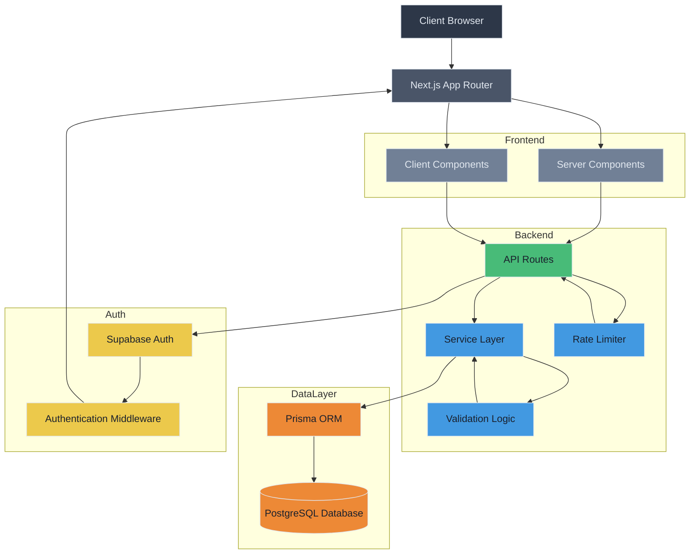

# Esahayak Assignment

A responsive buyer management application built with Next.js 14, TypeScript, and Tailwind CSS. This application features a modern UI with CRUD operations for managing buyer leads, simulated authentication flow, and responsive design that works on all device sizes.

## Features

- **Authentication Flow**: Email-based magic link authentication (simulated)
- **Buyer Management**: Create, view, edit, and list buyer leads
- **Search & Filtering**: Full-text search and filter capabilities
- **Responsive Design**: Works on mobile, tablet, and desktop devices
- **Modern UI**: Clean, intuitive interface with card-based layouts
- **Form Validation**: Client-side validation for all forms
- **History Tracking**: View change history for buyer records
- **Export Functionality**: Export buyer history as CSV
- **Rate Limiting**: API rate limiting for protection against abuse

## Tech Stack

- [Next.js 14](https://nextjs.org/) (App Router)
- [TypeScript](https://www.typescriptlang.org/)
- [Tailwind CSS](https://tailwindcss.com/)
- [React 19](https://react.dev/)
- [shadcn/ui](https://ui.shadcn.com/) components
- [Supabase](https://supabase.com/) for authentication
- [Prisma](https://www.prisma.io/) for database ORM
- [PostgreSQL](https://www.postgresql.org/) for data persistence

## Getting Started

### Prerequisites

- Node.js (version 18 or higher)
- pnpm (package manager)
- PostgreSQL database (or use Supabase)

### Environment Setup

1. Create a `.env.local` file in the root directory based on the existing `.env` file:
   ```bash
   cp .env .env.local
   ```

2. Update the environment variables in `.env.local`:
   ```env
   # Supabase configuration
   NEXT_PUBLIC_SUPABASE_URL=your_supabase_url
   NEXT_PUBLIC_SUPABASE_ANON_KEY=your_supabase_anon_key
   
   # Database connection
   DATABASE_URL=your_database_url
   
   # Site URL for magic links
   NEXT_PUBLIC_SITE_URL=http://localhost:3000
   ```

### Installation

1. Clone the repository:
   ```bash
   git clone https://github.com/itisrohit/esahayak_assignment
   ```

2. Navigate to the project directory:
   ```bash
   cd esahayak_assignment
   ```

3. Install dependencies:
   ```bash
   pnpm install
   ```

4. Generate Prisma client:
   ```bash
   npx prisma generate
   ```

5. Run database migrations:
   ```bash
   npx prisma migrate dev
   ```

### Running the Application

#### Development Mode

To run the application in development mode:

```bash
pnpm dev
```

The application will be available at http://localhost:3000

#### Production Mode

To build and run the application in production mode:

1. Build the application:
   ```bash
   pnpm build
   ```

2. Start the production server:
   ```bash
   pnpm start
   ```

The application will be available at http://localhost:3000

### Available Scripts

- `pnpm dev` - Runs the app in development mode
- `pnpm build` - Builds the app for production
- `pnpm start` - Runs the built app in production mode
- `pnpm lint` - Runs ESLint to check for linting errors
- `pnpm test` - Runs the test suite
- `pnpm seed` - Seeds the database with sample buyer data

## Database Setup

### Migrations

This application uses Prisma for database management. To set up the database:

1. Ensure your `DATABASE_URL` is correctly configured in `.env.local`
2. Run migrations:
   ```bash
   npx prisma migrate dev
   ```

This will create the necessary tables and apply any pending migrations.

### Seeding

To populate the database with sample data:

```bash
pnpm seed
```

This will create sample buyers with realistic data and history entries for testing purposes.

## Running Tests

To run the test suite:

```bash
pnpm test
```

This will run all tests using Jest and display the results. The test suite includes:

- Unit tests for validation functions
- CSV row validation tests

To run tests in watch mode (useful during development):

```bash
pnpm test --watch
```

To collect coverage information:

```bash
pnpm test --coverage
```

## Application Structure

- **Login Page**: `/login` - Email-based authentication with magic link
- **Buyers List**: `/authenticated/buyers` - View and search all buyers
- **Add New Buyer**: `/authenticated/buyers/new` - Create a new buyer lead
- **Buyer Detail**: `/authenticated/buyers/[id]` - View and edit buyer details

## Authentication

The application uses Supabase for authentication:
1. Enter your email on the login page
2. A magic link is "sent" to your email.
3. You'll be redirected to the buyers list page automatically


## Design Notes

### Validation

Validation is implemented at multiple levels to ensure data integrity and provide immediate feedback to users:

1. **Client-side validation**: 
   - Form validation using custom validation functions in React components
   - Real-time validation as users type in form fields
   - Prevents unnecessary API calls with invalid data

2. **Server-side validation**: 
   - Business logic validation in service layer (`src/lib/buyer-service.ts`)
   - Budget validation: Ensures `budgetMin` is less than or equal to `budgetMax`
   - BHK requirement validation: Required for residential property types (Apartment, Villa)
   - Ownership validation: Ensures ownerId is present when creating buyers
   - Error handling with descriptive error messages for API consumers

3. **Database constraints**: 
   - Prisma schema enforces data types, required fields, and enum values
   - Database-level validation for data integrity
   - Unique constraints and indexes for performance

Key validation rules:
- Budget validation: `budgetMin` must be less than or equal to `budgetMax`
- BHK requirement: Required for residential property types (Apartment, Villa)
- Required fields: fullName, phone, city, propertyType, purpose, timeline, source
- Ownership validation: ownerId must be set when creating buyers

Validation errors are propagated from the service layer to the API layer and returned to the client with descriptive error messages, enabling a seamless user experience with immediate feedback.

### SSR vs Client Components

The application follows Next.js 14 App Router patterns:

1. **Server Components (SSR)**:
   - Layout components (`layout.tsx`)
   - Page components that fetch data server-side
   - API routes (`src/app/api/**/*`)

2. **Client Components**:
   - Interactive UI components (marked with `"use client"`)
   - State management with React hooks
   - Components requiring browser APIs (localStorage, etc.)

The buyers list page (`src/app/authenticated/buyers/page.tsx`) is a client component that fetches data from API routes to enable dynamic filtering and pagination without full page reloads.

### Ownership Enforcement

Ownership is enforced at the API layer:

1. **Authentication**: All API routes require authentication via Supabase
2. **Authorization**: 
   - Read operations: Any authenticated user can read any buyer record
   - Write operations: Users can only modify buyers they own (created)
   - Ownership is tracked via `ownerId` field on buyer records

3. **Implementation**:
   - Middleware enforces authentication for protected routes
   - API routes verify ownership before allowing updates/deletes
   - Owner ID is automatically set when creating new buyers

4. **Concurrency Control**:
   - Optimistic locking using `updatedAt` timestamps
   - Clients send their last known `updatedAt` value
   - Server rejects updates if the record has been modified since

## Architecture Diagram



## What's Done vs Skipped

### Implemented Requirements (Must-haves)

✅ **Stack Requirements**:
- Next.js (App Router) + TypeScript
- PostgreSQL database with Prisma ORM and migrations
- Authentication with magic link flow
- Git with meaningful commits

✅ **Data Model**:
- Complete `buyers` table with all required fields (id, fullName, email, phone, city, propertyType, bhk, purpose, budgetMin, budgetMax, timeline, source, status, notes, tags, ownerId, updatedAt)
- Complete `buyer_history` table with all required fields (id, buyerId, changedBy, changedAt, diff)

✅ **Pages & Flows**:
- Create Lead form (`/authenticated/buyers/new`) with all required fields
- List & Search page (`/authenticated/buyers`) with SSR pagination (page size 10)
- URL-synced filters for city, propertyType, status, timeline
- Debounced search by fullName|phone|email
- Default sort by updatedAt desc
- View/Edit page (`/authenticated/buyers/[id]`) with all fields
- Concurrency control with updatedAt timestamp validation
- History rendering of changes from buyer_history

✅ **Import/Export**:
- CSV Import functionality with validation (max 200 rows)
- CSV Export of current filtered list

✅ **Ownership & Auth**:
- Anyone logged in can read all buyers
- Users can edit/delete only their own leads (ownerId check)
- Proper authentication flow with Supabase

✅ **Quality Bar**:
- Unit tests for validation functions (CSV row validator and budget validator)
- Rate limiting on create/update operations
- Error boundaries and empty states
- Accessibility features: labels, keyboard focus, form errors announced

### Implemented Nice-to-haves

✅ **Tag chips**: Tags are displayed as chips in both list and detail views

✅ **Basic full-text search**: Search functionality on fullName, phone, email, and notes

### Implemented Nice-to-haves

✅ **Tag chips**: Tags are displayed as chips in both list and detail views

✅ **Basic full-text search**: Search functionality on fullName, phone, email, and notes

✅ **Zod validation**: Zod validation has been fully implemented throughout the application:
- Client-side form validation in React components using Zod schemas
- Server-side API request validation for all buyer endpoints
- Type-safe validation with clear error messages
- Consistent validation rules across the entire application

### Skipped Nice-to-haves (and why)

❌ **Tag chips with typeahead**: While tags are displayed as chips, typeahead functionality was not implemented due to time constraints. The current implementation uses a simple input field for tags.

❌ **Status quick-actions**: Dropdown for quick status changes in the table view was not implemented. Users can change status through the edit form.

❌ **Optimistic edit with rollback**: While concurrency control is implemented with updatedAt timestamps, true optimistic updates with rollback capability were not implemented.

❌ **File upload for attachmentUrl**: File upload functionality was not implemented due to time constraints and complexity of handling file storage.

❌ **Admin role**: No admin role was implemented to allow editing all records. All users can only edit their own records.

The application is fully functional and meets all the must-have requirements. The skipped nice-to-haves were omitted primarily due to time constraints and focus on core functionality.

